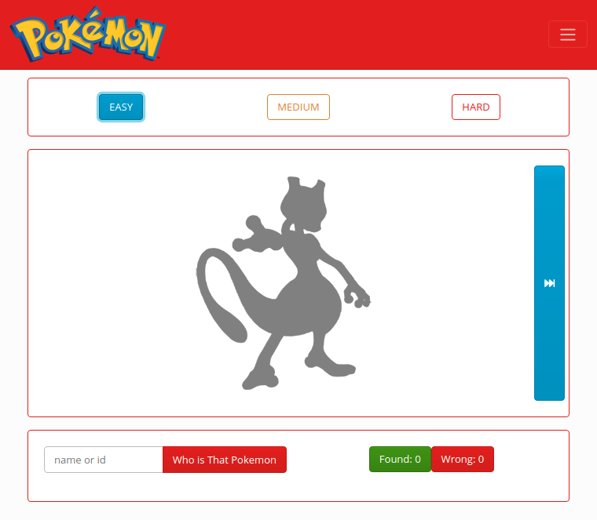

## My game **WhoIsThatPokemon**
___

This project was generated with [Angular CLI](https://github.com/angular/angular-cli) version 11.1.0.

This game was created in a couple of days using the pokeapi.co public api, which provides a lot of information about all the available pokemons.
The idea is to discover which pokemon is the one in the image or which id it has. It will show you the list of matches and failures. with three failures it will change to another pokemon.

the levels are easy with the first 150 pokemon, then medium with the first 300 pokemon and difficult with the complete list.

## Development server

> Run `ng serve` for a dev server. Navigate to `http://localhost:4200/`. The app will automatically reload if you change any of the source files.

enjoy 

Fabianko